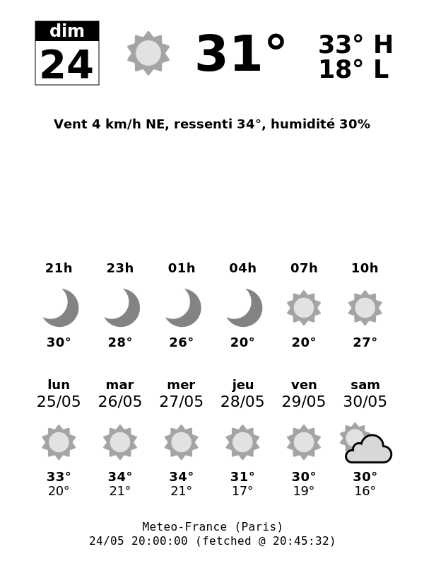

# meteofrance-ereader-weather

A lightweight weather server for e-readers such as the Kindle that uses [Méteo-France](https://meteofrance.com/)'s API

This repository is based on https://github.com/gadget1999/rpi-docker/tree/master/nook-weather



## Features

- Serves weather information to e-reader-friendly displays
- Uses `GPS_COORDINATES` for location
- Easy Docker deployment

## Environment variables

- `GPS_COORDINATES`: latitude,longitude
- `CITY_NAME`: override location name. If not set, the script will reverse-geocode `GPS_COORDINATES`.

## Endpoints

- `http://<ip>/forecast` — HTML weather forecast page
- `http://<ip>/ereader_image` — generated image for e-reader display

## Run with Docker

With Docker run

```sh
docker run -d -p 8080:8080 \
  -e GPS_COORDINATES=48.862137,2.3461315 \
  -e CITY_NAME=Paris \
  ghcr.io/auxbh/meteofrance-ereader-weather:main
```

With Docker compose

```sh
services:
  nmeteofrance-ereader-weather:
    image: ghcr.io/auxbh/meteofrance-ereader-weather:main
    container_name: meteofrance-ereader-weather
    restart: unless-stopped

    environment:
      GPS_COORDINATES: 48.862137,2.3461315
      CITY_NAME: Paris

    ports:
      - "8080:8080"
```

## Local build for developping

Build with Docker

```sh
docker build -t meteofrance-ereader-weather .
```

Run the image
```sh
docker run -d -p 8080:8080 \
  -e GPS_COORDINATES=48.862137,2.3461315 \
  -e CITY_NAME=Paris \
  meteofrance-ereader-weather
```